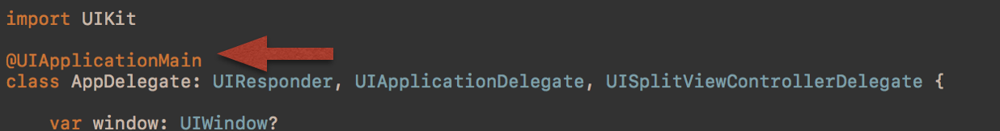
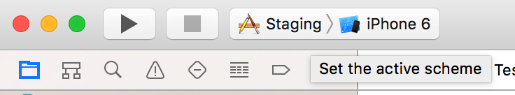
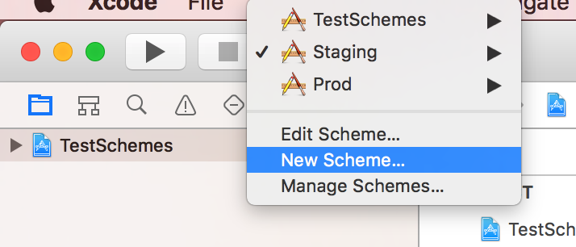
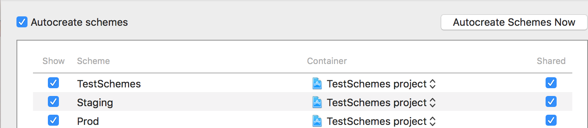
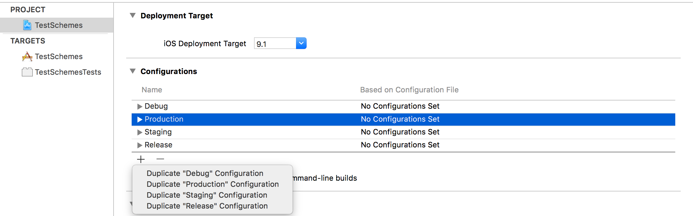
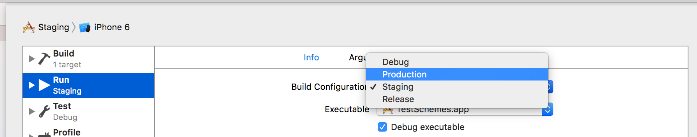
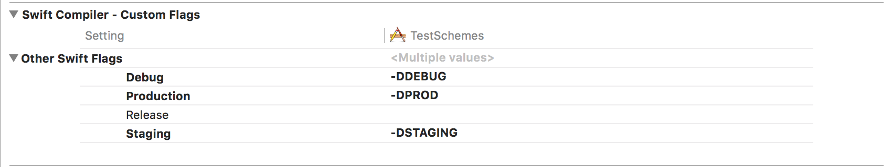

#Xcode Schemes Example

Many times we have differents urls based on the environment that we are working on. So in this case, we can define differents `schemes` to run the app with the correct environment.

###Important: This works with AppDelegate that contains `@UIApplicationMain` annotation

## Define Schemes

####1.	Go to Schemes

####2. Create a new one

####3. Share it

####4. Create a new build configuration duplicating an existing one

####5. Associate the new configuration with our new scheme

####6. Define flags that you will use to determine the environmet in `Target -> Build Setting -> Swift Flags`
